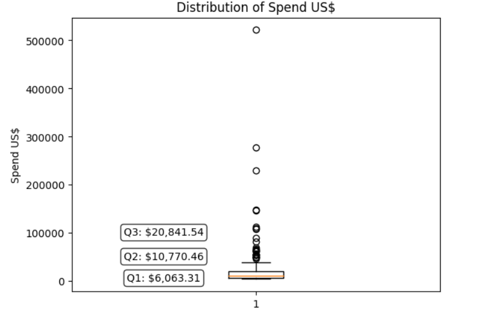
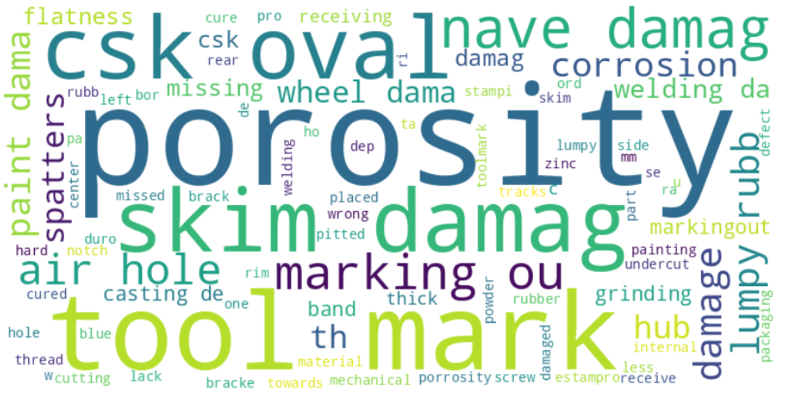
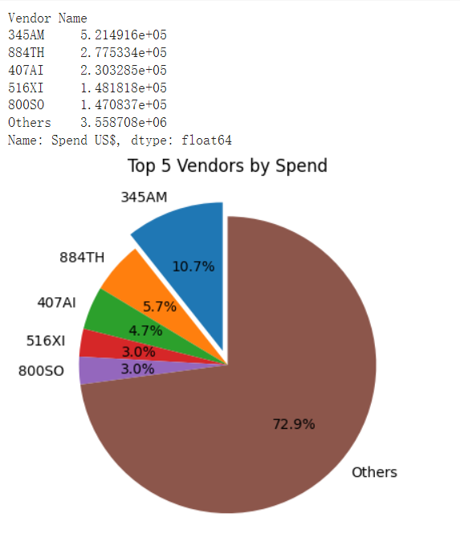
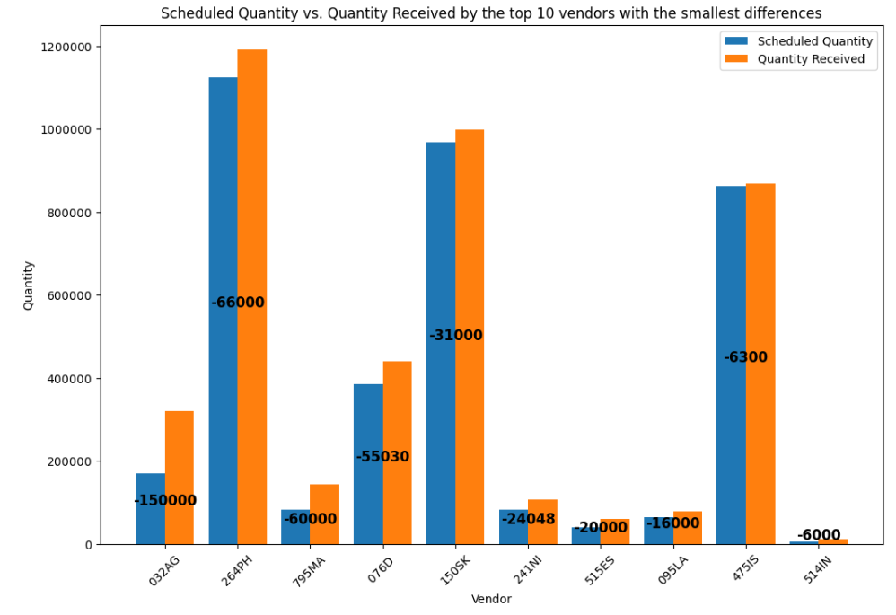

# Supper_analysis

# Key findings: Based on all the analysis above, there are three main recommendations for 2023 according to the delivery, quality and spend issues mentioned above.  

*   Firstly, the delivery issues with the 345AM supplier, which is the biggest supplier in terms of demand but has problems with delivering the required amount. Additionally, the overall issue of delayed deliveries needs to be addressed. Exploring suitable alternatives may be one solution of that.
*   Secondly, regarding product quality issues, the problems with casting porosity and skim/nave damage need to be addressed as they are causing excessive additional costs and may affect the core tire products. These issues need to be taken seriously as well.  

*  Finally, the excessive concentration of spending on suppliers needs to be thoroughly investigated with more detailed data if any.

## Authors
Copyright all reserved 
- [@Alexmu](https://www.github.com/Alexmxz)

Distribution between the suppliers.

Building Word cloud of issue for different parts received 

Spending for different suppliers proportion 

different between expetation and real received orders

